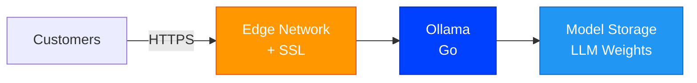
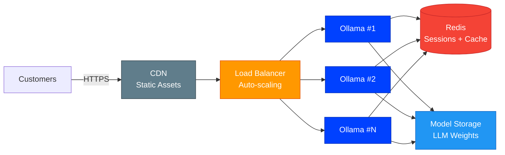

# Ollama [](https://github.com/stackblaze-templates/ollama) [](https://stackblaze.com) [](https://github.com/stackblaze-templates/ollama/actions) [](LICENSE) [](https://stackblaze.com)

<p align="center"></p>

Run large language models locally. Pull and serve open-source models like Llama, Mistral, Gemma, and more.

> **Credits**: Built on [Ollama](https://ollama.com) by [Ollama](https://github.com/ollama). All trademarks belong to their respective owners.

## Local Development

```bash
docker compose up
```

See the project files for configuration details.

## Deploy on StackBlaze

[](https://stackblaze.com)

This template includes a `stackblaze.yaml` for one-click deployment on [StackBlaze](https://stackblaze.com). Both options run on **Kubernetes** for reliability and scalability.

<details>
<summary><strong>Standard Deployment</strong> — Single-instance Kubernetes setup for startups and moderate traffic</summary>

<br/>



**What you get:**
- Single Ollama instance on Kubernetes
- Automatic SSL/TLS via StackBlaze edge network
- Persistent model storage for LLM weights
- Automated daily backups
- Zero-downtime deploys

**Best for:** Development, staging, and moderate-traffic production environments.

</details>

<details>
<summary><strong>High Availability Deployment</strong> — Multi-instance Kubernetes setup for business-critical production</summary>

<br/>



**What you get:**
- Auto-scaling Ollama pods on Kubernetes behind a load balancer
- Redis for shared sessions, cache, and queue management
- CDN for static assets
- Shared persistent model storage
- Automated failover and self-healing
- Zero-downtime rolling deploys

**Best for:** Production workloads, high-traffic applications, business-critical deployments.

</details>

---

## Security Considerations

> **⚠️ Ollama has no built-in authentication.** The API on port 11434 is unauthenticated by default. Anyone who can reach that port can run models and consume resources.

- **Do not expose port 11434 directly to the public internet.** Place a reverse proxy (e.g. nginx, Caddy) with authentication in front of Ollama if remote access is required.
- **Restrict allowed origins** with the `OLLAMA_ORIGINS` environment variable if you embed Ollama in a web application (default allows all origins when accessed locally).
- **Network binding**: the `docker-compose.yml` in this template binds the API port to `127.0.0.1` (localhost only). Remove the `127.0.0.1:` prefix only if you have a firewall or other network-level control in place.
- **Non-root container**: the `Dockerfile` creates a dedicated `ollama` user so the process does not run as root inside the container.

---

### Maintained by [StackBlaze](https://stackblaze.com)

This template is actively maintained by StackBlaze. We perform **weekly automated checks** to ensure:

- **Up-to-date dependencies** — frameworks, libraries, and base images are kept current
- **Security scanning** — continuous monitoring for known vulnerabilities and CVEs
- **Best practices** — configurations follow current recommendations from upstream projects

Found an issue? [Open a ticket](https://github.com/stackblaze-templates/ollama/issues).
